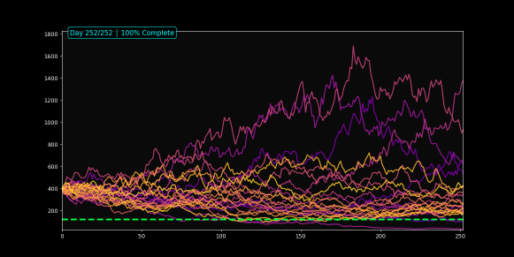
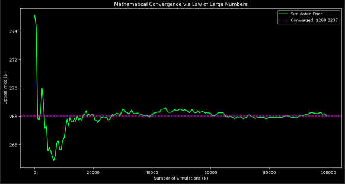

# Path-Dependent Asian Option Pricing Engine

[](https://www.python.org/downloads/)
[](https://opensource.org/licenses/MIT)
[](https://colab.research.google.com/drive/1mqXzvf6dZIpKw2JdfUL6rrJZzWCdgPc4?usp=sharing)

## 01. Logic Overview
This project implements a high-performance **Monte Carlo simulation** to price Arithmetic Asian Call/Put options. 

Because Asian options depend on the average price over a duration, they lack a closed-form Black-Scholes solution. This engine solves that by simulating 100,000+ potential price trajectories through **Geometric Brownian Motion (GBM)**.



---

## 02. Core Financial Engineering
The model is built on three pillars of quantitative finance:

### A. Stochastic Price Diffusion
The underlying asset follows the SDE:

$$dS_t = r S_t dt + \sigma S_t dW_t$$

I used **Ito’s Lemma** to transform this into the discrete-time version used in the code:

$$S_{t+\Delta t} = S_t \exp\left((r - \frac{1}{2}\sigma^2)\Delta t + \sigma \sqrt{\Delta t} Z\right)$$

*The inclusion of the -0.5σ² term is critical to account for volatility drag.*

### B. Business Time (252-Day Rule)
Standard calendar-day simulations overestimate volatility. This engine hardcodes a **252-trading day year**, ensuring the $\Delta t$ ($T/steps$) correctly scales the annualized volatility to market hours.

### C. Vectorized Path Averaging
Instead of iterative loops, I utilized **NumPy broadcasting** to calculate the arithmetic average across the horizontal axis of a $100,000 \times 252$ matrix.

---

## 03. Statistical Validation
To ensure the "Fair Value" is accurate, the engine tracks the **Standard Error of the Mean (SEM)**. 

* **Convergence:** The model follows the $1/\sqrt{N}$ rule. As the number of paths ($N$) increases, the simulation noise (variance) decays.
* **Confidence Interval:** Every price comes with a 95% confidence band ($Price \pm 1.96 \times SEM$), proving the mathematical stability of the result.



---

## 04. Simulation Results & Stress Testing
Testing the engine under extreme "Tail Risk" parameters:
* **Inputs:** $S_0=400, \sigma=80\%, r=15\%, T=1$
* **Fair Value:** ~$267.81
* **Observation:** The high price reflects the extreme convexity of the option in a high-volatility environment.

---

## 05. Visual Suite
The engine produces three distinct visual outputs:
1.  **Dynamic Diffusion:** An animated "Random Walk" showing price dispersion.
2.  **Convergence Analysis:** A plot showing the price "settling" as $N$ grows.
3.  **Strike Analysis:** A static view of paths relative to the Strike ($K$).

---

## 🛠 Setup & Usage
1.  **Run in Google Colab:** Click the **"Open In Colab"** badge at the top of this README.
2.  **Local Execution:**
    ```bash
    pip install numpy matplotlib
    python asian_option_engine.py
    ```
